# 📱 Menoid — Android App

> A private crypto wallet for the multi-chain world.
>
> [menoid.xyz](https://menoid.xyz)

One wallet, one address, two modes. **Open Mode** is an ordinary multi-chain
wallet. **Noid Mode** moves the same funds through a zero-knowledge privacy pool
— balances, senders, receivers and amounts stay hidden. Monad, Ethereum
Sepolia, Base Sepolia, Solana, Sui and Aptos.

React Native / Expo, ported from the
[browser extension](https://github.com/menoid-wallet/Wallet). The key
derivation is identical on both, so the same seed phrase gives you the same
on-chain identity in either one.

The protocol, circuits and contracts live in
**[menoid-wallet/menoid](https://github.com/menoid-wallet/menoid)**, and the
full write-up is in **[menoid-wallet/Docs](https://github.com/menoid-wallet/Docs)**.

---

## 🎬 Demo

Captured on an Android emulator against **Monad testnet** with the real
contracts — the registration below is a real transaction.

### Create a wallet

| 1. Welcome | 2. Create or import | 3. Recovery phrase |
|---|---|---|
| 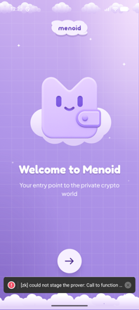 | 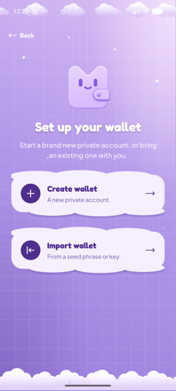 |  |

| 4. Name the account | 5. Set a password | 6. Unlock |
|---|---|---|
| 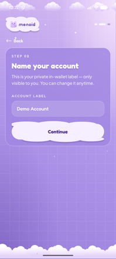 | 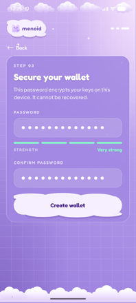 | 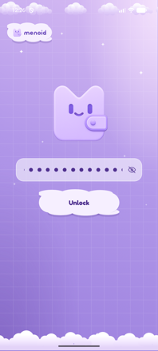 |

The password encrypts the keys on the device (PBKDF2 + AES-GCM, PBKDF2 running
native). Closing the app forgets the decrypted copy, so it always reopens
locked.

### Open Mode — six chains, one address

| 7. Balances | 8. A single chain | 9. Receive |
|---|---|---|
| 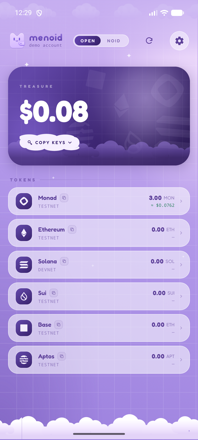 | 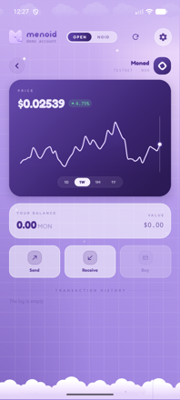 | 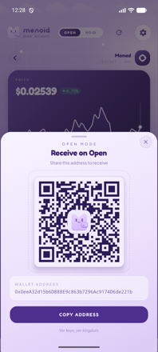 |

### Noid Mode — register, then go private

Registering signs one message and binds your address to a private identity
on-chain. Only funded chains can register.

| 10. Pick chains to register | 11. Registered on Monad | 12. Private balance |
|---|---|---|
|  | 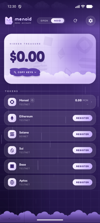 | 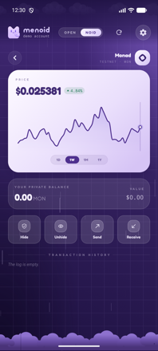 |

### Send privately

Paste an ordinary wallet address. The app resolves that address's private
identity **straight from the chain** — both the user commitment and the
encryption key are registered on-chain, so no server can answer wrong.

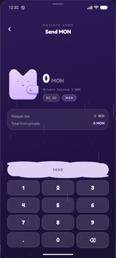

---

## 📁 Layout

```
src/
  polyfills.ts            Buffer + getRandomValues, imported first
  crypto/                 walletCrypto (PBKDF2 + AES-GCM), keyDerivation, babyjub
  lib/                    networks, config, RPC, storage, merkle tree
  services/               register, mask, unmask, noidSend, zkProver, prices
  context/                the unlocked session + view mode + pool state
  components/setup/       Welcome, CreateWallet, ImportWallet, LockScreen
  components/modes/       OpenModeView · NoidModeView · RegisterView
  components/shared/      mask / unmask / send modals, treasure card
  theme/                  palette, sky gradients, fonts, open/noid tokens
android/                  the native project
```

### Proofs run in a WebView, on purpose

snarkjs delegates its arithmetic to ffjavascript, which **imports** a
`WebAssembly.Memory` and then grows it as the module runs. No JS shim can fake
that, and wasm3 (behind `react-native-webassembly`) has no imported memory at
all. Android's WebView is a full Chromium, so snarkjs runs there completely
unmodified — the app produces the *same proof* as the extension, from the same
circuits, rather than a reimplementation that could drift. `src/services/zkProver.tsx`
mounts one hidden WebView for the life of the app and copies the circuit
artifacts into the cache directory once.

---

## 🚀 Running it

```bash
npm install
npm run android          # build + install on a booted emulator or device
```

A debug build needs Metro; point the emulator at the host with
`adb reverse tcp:8081 tcp:8081`, and at a local relayer with
`adb reverse tcp:4000 tcp:4000`.

Use Android Studio's bundled JDK — a Homebrew JDK 26 will not build this.

```bash
cd android && JAVA_HOME="/Applications/Android Studio.app/Contents/jbr/Contents/Home" \
  ANDROID_HOME="$HOME/Library/Android/sdk" ./gradlew :app:assembleRelease
```

Output: `android/app/build/outputs/apk/release/app-release.apk` — standalone
(the JS bundle is embedded), universal, signed with the debug keystore.
Generate a real signing key before any store release.

Addresses and endpoints come from `EXPO_PUBLIC_*` variables in `.env`, which
Expo inlines **at build time**. Change one and rebuild, don't just reload. Keep
them in step with
[`menoid/deploy.txt`](https://github.com/menoid-wallet/menoid/blob/main/deploy.txt).

### Verification scripts

The app derives keys itself rather than importing the extension's code, so two
scripts pin it to the extension. Run them after ANY change to derivation:

```bash
node --experimental-strip-types scripts/verify-babyjub.ts      # vs circomlibjs
node --experimental-strip-types scripts/verify-derivation.ts   # vs the extension
node scripts/verify-register-ix.cjs                            # vs the Solana IDL
```

The last one matters because the Solana `register` instruction is hand-built
here instead of through Anchor (a large dependency to carry onto a phone for
eight bytes and two 32-byte arguments). It asserts the encoding matches the
real IDL — discriminator, account order, argument layout and PDA seed.

---

## 🛠️ Android notes (hard-won — read before touching the UI)

- **Never put `elevation`/`shadow*` on a translucent view.** Android paints the
  shadow behind it, so it shows *through* the glass as a hard dark rectangle.
- **Keep `textShadowRadius` small (≤6)** or it rasterises as a grey plate.
- **Never animate SVG geometry props.** They cannot use the native driver, so
  every frame crosses into JS. The blink animates a `<View>` `scaleY` instead.
- **Don't stretch cloud shapes with `preserveAspectRatio="none"`** — it squashes
  the lobes. `CloudSurface` computes true ellipses from the measured box.
- **Memoise every brand component.** Sky/Clouds/CloudChip/Wordmark are large
  vector trees; without `memo` a single keystroke re-renders all of them.
- **No SVG filters.** `<FeDropShadow>` forces an offscreen pass + blur on every
  draw. Two offset silhouettes look the same and cost two fills.
- **Yield a frame before blocking crypto** (`await setTimeout(…, 50)`) or React
  never paints the spinner and the app looks frozen.

---

## 🔗 Related

| Repository | What it is |
|---|---|
| ⛓️ **[menoid-wallet/menoid](https://github.com/menoid-wallet/menoid)** | Circuits and on-chain contracts |
| 📖 **[menoid-wallet/Docs](https://github.com/menoid-wallet/Docs)** | Protocol documentation |
| 🧩 **[menoid-wallet/Wallet](https://github.com/menoid-wallet/Wallet)** | The browser extension and the relayer |
| 🌐 **[menoid-wallet/website](https://github.com/menoid-wallet/website)** | [menoid.xyz](https://menoid.xyz) |

---

## ⚠️ Status

Testnet. Unaudited. Do not put real funds anywhere near this.

---

**Menoid — A Private Crypto Wallet.**
